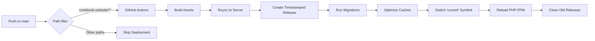

# Server Setup Scripts

Two helper scripts to manage the Ableton Cookbook deployment:

## 1. Check Deployment Status

**Quick health check** - see if files deployed, nginx config exists, etc.

```bash
./.claude/check_deployment.sh
```

This will prompt for your server password and show:
- Files in releases directory
- Current symlink status
- Nginx config presence
- HTTPS response
- .env file existence
- Recent Laravel logs

## 2. Complete Server Setup

**One-time setup** - run this on the server after first successful GitHub Actions deployment.

```bash
# Copy script to server
scp -P 22022 .claude/setup_server.sh root@209.74.71.83:/root/

# SSH into server
ssh -p 22022 -o PubkeyAuthentication=no root@209.74.71.83

# Run setup script
cd /root && chmod +x setup_server.sh && ./setup_server.sh
```

### What it does:

1. ✅ Creates Nginx config for ableton.recipes
2. ✅ Enables the site and reloads Nginx
3. ✅ Creates shared storage directories
4. ✅ Generates .env file with secure defaults
5. ✅ Creates MySQL database `ableton_cookbook`
6. ✅ Creates database user `ableton_user`
7. ✅ Generates Laravel APP_KEY
8. ✅ Runs database migrations
9. ✅ Caches configs, routes, and views
10. ✅ Sets up Supervisor queue workers

### After Setup:

**Enable SSL (required for HTTPS):**
```bash
certbot --nginx -d ableton.recipes -d www.ableton.recipes
```

Then uncomment the SSL lines in `/etc/nginx/sites-available/ableton-cookbook` and reload:
```bash
nano /etc/nginx/sites-available/ableton-cookbook
systemctl reload nginx
```

**Create admin user:**
```bash
cd /var/www/ableton-cookbook/current
php artisan tinker

# In tinker:
User::create([
    'name' => 'Admin',
    'email' => 'your@email.com',
    'password' => bcrypt('your-secure-password')
]);
```

**Seed roles/permissions (if applicable):**
```bash
php artisan db:seed --class=RolesAndPermissionsSeeder
```

## Troubleshooting

**404 Error?**
- Check: `ls -la /var/www/ableton-cookbook/current/public`
- Nginx should point to `current/public` not just `current`

**500 Error?**
- Check Laravel logs: `tail -50 /var/www/ableton-cookbook/shared/storage/logs/laravel.log`
- Check Nginx logs: `tail -50 /var/log/nginx/ableton-cookbook-error.log`
- Verify .env database credentials are correct

**Deployment not triggering?**
- Workflow must be in `.github/workflows/` at repo root
- Check: https://github.com/teamallnighter/ableton-cookbook-mcp/actions
- Path filter requires changes in `cookbook-website/**`

**Files not deploying?**
- Verify GitHub secrets: `DEPLOY_SSH_KEY`, `HOST`, `USERNAME`
- Check Actions logs for rsync errors
- SSH key must match server's authorized_keys

## File Locations

- **App Root:** `/var/www/ableton-cookbook/`
- **Current Release:** `/var/www/ableton-cookbook/current` (symlink)
- **Releases:** `/var/www/ableton-cookbook/releases/TIMESTAMP/`
- **Shared Files:** `/var/www/ableton-cookbook/shared/`
- **.env:** `/var/www/ableton-cookbook/shared/.env`
- **Storage:** `/var/www/ableton-cookbook/shared/storage/`
- **Nginx Config:** `/etc/nginx/sites-available/ableton-cookbook`
- **Web Root:** `/var/www/ableton-cookbook/current/public` ← Nginx points here

## Deployment Flow



## Quick Reference Commands

```bash
# Check deployment status (local)
./.claude/check_deployment.sh

# View live logs (server)
tail -f /var/www/ableton-cookbook/shared/storage/logs/laravel.log

# Restart queue workers (server)
supervisorctl restart ableton-cookbook-worker:*

# Clear all Laravel caches (server)
cd /var/www/ableton-cookbook/current
php artisan cache:clear
php artisan config:clear
php artisan route:clear
php artisan view:clear

# Rebuild optimized caches (server)
php artisan config:cache
php artisan route:cache
php artisan view:cache

# Check Nginx syntax (server)
nginx -t

# Reload Nginx (server)
systemctl reload nginx

# View recent releases (server)
ls -lah /var/www/ableton-cookbook/releases/
```
